# 🏗️ Professional Architecture Diagrams

## 📊 High-Level Architecture (Mermaid)

```mermaid
graph TB
    subgraph "🌐 Client Layer"
        WEB[Web Frontend]
        MOBILE[Mobile App]
        API_CLIENT[API Client]
    end
    
    subgraph "🎯 API Gateway Layer"
        GATEWAY[API Gateway<br/>Port: 3001]
    end
    
    subgraph "🏛️ Application Layer"
        subgraph "🚛 Carrier Module"
            C_CTRL[Carrier Controller]
            C_SVC[Carrier Service]
            C_ENTITY[Carrier Entity]
        end
        
        subgraph "👥 Customer Module"
            CU_CTRL[Customer Controller]
            CU_SVC[Customer Service]
            CU_ENTITY[Customer Entity]
        end
        
        subgraph "💰 Pricing Module"
            P_CTRL[Pricing Controller<br/>(Future)]
            P_SVC[Pricing Service<br/>(Future)]
            P_ENTITY[Pricing Entity<br/>(Future)]
        end
    end
    
    subgraph "🔌 Infrastructure Layer"
        DB[(MySQL Database)]
        CACHE[(Redis Cache)]
        LOGS[Logging System]
        MSG[Message Queue<br/>(Future)]
    end
    
    subgraph "🔗 Shared Components"
        KERNEL[Shared Kernel<br/>BaseEntity, Result, Events]
        DTO[Common DTOs<br/>Pagination, Response]
        UTILS[Utility Functions]
    end
    
    %% Client connections
    WEB --> GATEWAY
    MOBILE --> GATEWAY
    API_CLIENT --> GATEWAY
    
    %% API Gateway to Controllers
    GATEWAY --> C_CTRL
    GATEWAY --> CU_CTRL
    GATEWAY --> P_CTRL
    
    %% Controller to Service
    C_CTRL --> C_SVC
    CU_CTRL --> CU_SVC
    P_CTRL --> P_SVC
    
    %% Service to Entity
    C_SVC --> C_ENTITY
    CU_SVC --> CU_ENTITY
    P_SVC --> P_ENTITY
    
    %% Infrastructure connections
    C_ENTITY --> DB
    CU_ENTITY --> DB
    P_ENTITY --> DB
    
    C_SVC --> CACHE
    CU_SVC --> CACHE
    P_SVC --> CACHE
    
    C_SVC --> LOGS
    CU_SVC --> LOGS
    P_SVC --> LOGS
    
    %% Shared components
    C_ENTITY -.-> KERNEL
    CU_ENTITY -.-> KERNEL
    P_ENTITY -.-> KERNEL
    
    C_CTRL -.-> DTO
    CU_CTRL -.-> DTO
    P_CTRL -.-> DTO
    
    C_SVC -.-> UTILS
    CU_SVC -.-> UTILS
    P_SVC -.-> UTILS
    
    %% Styling
    classDef clientClass fill:#e1f5fe,stroke:#01579b,stroke-width:2px
    classDef apiClass fill:#f3e5f5,stroke:#4a148c,stroke-width:2px
    classDef serviceClass fill:#e8f5e8,stroke:#1b5e20,stroke-width:2px
    classDef entityClass fill:#fff3e0,stroke:#e65100,stroke-width:2px
    classDef infraClass fill:#fce4ec,stroke:#880e4f,stroke-width:2px
    classDef sharedClass fill:#f1f8e9,stroke:#33691e,stroke-width:2px
    
    class WEB,MOBILE,API_CLIENT clientClass
    class GATEWAY,C_CTRL,CU_CTRL,P_CTRL apiClass
    class C_SVC,CU_SVC,P_SVC serviceClass
    class C_ENTITY,CU_ENTITY,P_ENTITY entityClass
    class DB,CACHE,LOGS,MSG infraClass
    class KERNEL,DTO,UTILS sharedClass
```

## 🏗️ Clean Architecture Layers (Mermaid)

```mermaid
graph TB
    subgraph "🎯 Clean Architecture Layers"
        subgraph "🌐 API Layer"
            CTRL[Controllers<br/>HTTP Handlers<br/>Request/Response]
        end
        
        subgraph "🔧 Application Layer"
            SVC[Services<br/>Use Cases<br/>Business Logic]
            DTO[DTOs<br/>Data Transfer<br/>Validation]
        end
        
        subgraph "🏛️ Domain Layer"
            ENT[Entities<br/>Business Objects<br/>Domain Rules]
            EVT[Events<br/>Domain Events<br/>Business Events]
            REPO[Repositories<br/>Data Access<br/>Interfaces]
        end
        
        subgraph "🔌 Infrastructure Layer"
            DB_REPO[Database<br/>Repositories<br/>TypeORM]
            CACHE_REPO[Cache<br/>Redis<br/>In-Memory]
            EXT[External<br/>Services<br/>APIs]
        end
    end
    
    %% Dependencies (pointing inward)
    CTRL --> SVC
    SVC --> ENT
    SVC --> EVT
    SVC --> REPO
    REPO --> DB_REPO
    REPO --> CACHE_REPO
    SVC --> EXT
    
    %% Styling
    classDef apiLayer fill:#e3f2fd,stroke:#0277bd,stroke-width:3px
    classDef appLayer fill:#e8f5e8,stroke:#2e7d32,stroke-width:3px
    classDef domainLayer fill:#fff3e0,stroke:#f57c00,stroke-width:3px
    classDef infraLayer fill:#fce4ec,stroke:#c2185b,stroke-width:3px
    
    class CTRL apiLayer
    class SVC,DTO appLayer
    class ENT,EVT,REPO domainLayer
    class DB_REPO,CACHE_REPO,EXT infraLayer
```



## 📁 Directory Structure (Mermaid)


## 🔄 Data Flow (Mermaid)


## 🚀 API Endpoints (Mermaid)

```mermaid
graph LR
    subgraph "🚛 Carrier Endpoints"
        C1[POST /carriers]
        C2[GET /carriers]
        C3[GET /carriers/active]
        C4[GET /carriers/:id]
        C5[PATCH /carriers/:id]
        C6[DELETE /carriers/:id]
    end
    
    subgraph "👥 Customer Endpoints"
        CU1[POST /customers]
        CU2[GET /customers]
        CU3[GET /customers/active]
        CU4[GET /customers/email/:email]
        CU5[GET /customers/:id]
        CU6[PATCH /customers/:id]
        CU7[DELETE /customers/:id]
    end
    
    subgraph "💰 Pricing Endpoints"
        P1[Future Sprint]
    end
    
    %% Styling
    classDef carrierClass fill:#e8f5e8,stroke:#2e7d32,stroke-width:2px
    classDef customerClass fill:#e3f2fd,stroke:#1565c0,stroke-width:2px
    classDef pricingClass fill:#fff3e0,stroke:#ef6c00,stroke-width:2px
    
    class C1,C2,C3,C4,C5,C6 carrierClass
    class CU1,CU2,CU3,CU4,CU5,CU6,CU7 customerClass
    class P1 pricingClass
```



## 🎯 How to Use These Diagrams

### **1. 📊 Mermaid Live Editor**
- Go to [mermaid.live](https://mermaid.live)
- Copy and paste any diagram code
- Export as PNG, SVG, or PDF

### **2. 🔧 VS Code**
- Install "Mermaid Preview" extension
- Create `.md` files with mermaid code blocks
- Preview and export diagrams

### **3. 📚 GitHub/GitLab**
- Native Mermaid support
- Just paste the code in markdown files
- Automatically renders in repositories

### **4. 📖 Documentation**
- GitBook, Notion, Confluence
- Most modern documentation tools support Mermaid
- Professional presentation ready

These Mermaid diagrams provide a professional, scalable way to visualize your architecture that can be easily maintained and updated as your system evolves! 🎉
